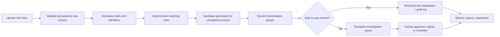
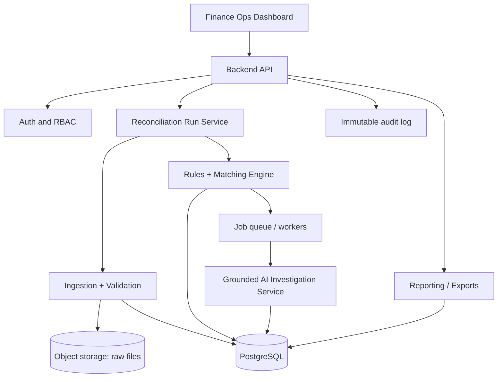

# TallyProof — Track 4: AI Finance Controller

> **Project blueprint for architecture, implementation, evaluation, and demo**  
> Built for Razorpay Hackathon — Track 4: AI Finance Controller

## 1. One-line idea

**TallyProof is an AI-assisted financial reconciliation and exception-investigation system that connects payments, Razorpay settlements, bank statements, invoices, and internal ledgers; matches records accurately; explains discrepancies; and safely routes uncertain cases to a finance operator.**

## 2. Problem statement

Finance operations teams must answer a deceptively difficult question every day: **does the money recorded in internal systems actually agree with what the payment gateway, bank, and settlement reports say?**

For one customer payment, information may be distributed across several sources:

| Source | Typical record | What it tells us |
|---|---|---|
| Payment gateway | payment, refund, fee, dispute | What the customer transaction did |
| Razorpay settlement | settlement batch / line item | What amount was scheduled or paid out after fees/refunds |
| Bank statement | credit/debit entry | What money actually reached or left the bank |
| Invoice or order system | invoice/order | What the business expected to collect |
| Internal ledger | journal entry | What the company recorded in its books |

These records rarely line up perfectly. A settlement can combine many payments. A payment may settle one or more days later. Gateway fees and GST can make the net settlement lower than the gross customer payment. Refunds, reversals, disputes, failed payouts, duplicated imports, missing files, time-zone differences, partial payments, and reference-ID mismatches all create exceptions.

Manual reconciliation is slow, repetitive, difficult to audit, and vulnerable to mistakes. More importantly, a spreadsheet can flag that two amounts differ, but it cannot reliably explain *why* they differ or state how confident it is in a proposed resolution.

### The challenge

Build an AI Finance Controller that can process a large batch of synthetic financial records, reconcile records across multiple sources, investigate mismatches, produce explainable decisions, measure its own quality, and keep genuinely ambiguous cases for human review.

## 3. Why build TallyProof

TallyProof solves a real finance-operations bottleneck:

- **Faster close:** automatically clears routine transactions and reduces manual spreadsheet work.
- **Lower financial risk:** identifies missing money, duplicate postings, fee errors, settlement failures, and suspicious patterns early.
- **Better decisions:** converts raw mismatches into evidence-backed explanations and recommended actions.
- **Auditability:** preserves source data, matching logic, confidence, explanations, and reviewer actions for every decision.
- **Responsible AI:** automates high-confidence work while preserving human authority over uncertain or material cases.

The project is also a good demonstration of a practical AI system: deterministic financial controls do the accounting math, while AI assists with ambiguous matching, natural-language investigation, evidence summarisation, and operator experience. It should never invent a financial outcome.

## 4. Product goals and boundaries

### Goals

1. Ingest multi-source transaction data in CSV/JSON form.
2. Normalise all records into a reliable common schema.
3. Match records deterministically where evidence is strong.
4. Support one-to-one, one-to-many, and many-to-one reconciliation.
5. Detect and classify exceptions with clear root-cause hypotheses.
6. Use an LLM only to assist investigation and explanations, grounded in retrieved evidence.
7. Assign a confidence score and automatically resolve only safe cases.
8. Provide a review queue, audit trail, reconciliation metrics, and downloadable results.

### Non-goals for the hackathon MVP

- Moving money, creating payouts, or changing a real accounting system.
- Treating an LLM response as accounting truth without validation.
- Replacing accountant approval for material adjustments.
- Claiming production-grade regulatory compliance or direct live Razorpay integration unless it has been implemented and tested.

## 5. Users and jobs to be done

### Finance operations analyst

Wants a daily queue of exceptions sorted by risk and a clear path to resolve each one.

### Finance controller

Wants reliable reconciliation status, aging, exposure, and an audit-ready explanation for every material discrepancy.

### Auditor or reviewer

Wants immutable evidence: original source values, rule/AI version, matching rationale, approvals, and timestamps.

### Engineering/data operations team

Wants clear ingestion errors, data-quality reports, and predictable APIs rather than silent data corruption.

## 6. Requirements

### Functional requirements

1. **Data ingestion** — upload or load payment, settlement, bank, invoice/order, and ledger datasets.
2. **Validation** — reject malformed rows; report missing mandatory fields, invalid dates/currency, and duplicate source IDs.
3. **Normalisation** — standardise timestamps, decimal currency amounts, IDs, status values, and reference strings.
4. **Reconciliation runs** — create a repeatable, versioned run for a selected date range/files.
5. **Matching engine** — perform exact, fuzzy, batch, and tolerance-based matching.
6. **Exception engine** — identify unmatched, amount, date, fee, duplicate, refund, and status discrepancies.
7. **Investigation workspace** — show linked evidence, calculations, hypotheses, recommended action, and confidence.
8. **Human review** — allow approve, reject, override, assign, comment, and mark resolved with a reason.
9. **Reporting** — show totals, match rate, unresolved count/value, aging, accuracy, and exportable results.
10. **Audit trail** — log every imported record, match decision, rule version, AI output, user action, and timestamp.

### Non-functional requirements

- **Correctness first:** use integer minor units (paise) or fixed-point decimals; never floating-point money.
- **Explainability:** every resolution must show links and calculations that support it.
- **Safety:** auto-resolution must be policy-gated by confidence, value, and exception type.
- **Security:** encrypt credentials; restrict role access; mask sensitive customer fields in UI/logs.
- **Reliability:** processing must be idempotent; rerunning the same input must not duplicate outcomes.
- **Performance:** target bulk processing of the hackathon dataset in a few minutes, with progress reporting.
- **Observability:** retain structured logs, run metrics, validation failures, and model/rule versions.

## 7. Canonical data model

All source records should be retained unchanged and also mapped to a canonical transaction representation.

```text
SourceRecord
  id, source_system, source_file, raw_payload, imported_at, row_hash

CanonicalTransaction
  id, source_record_id, entity_type, source_system, external_id
  parent_external_id, reference_id, customer_ref, currency
  gross_amount_minor, fee_amount_minor, tax_amount_minor, net_amount_minor
  direction (credit|debit), status, event_at, available_at
  counterparty, description, metadata, normalized_at

ReconciliationGroup
  id, run_id, group_type, status, confidence, total_amount_minor
  explanation, created_at, resolved_at

ReconciliationLink
  group_id, transaction_id, role, matched_amount_minor, evidence_json

ExceptionCase
  id, run_id, case_type, severity, status, amount_at_risk_minor
  hypothesis, recommendation, confidence, assigned_to, due_at

DecisionAuditEvent
  id, entity_type, entity_id, action, actor_type, actor_id
  rule_version, model_version, payload_json, created_at
```

### Recommended source fields

| Dataset | Minimum useful fields |
|---|---|
| Payments | `payment_id`, `order_id`, `amount`, `currency`, `status`, `created_at`, `method` |
| Settlements | `settlement_id`, `payment_id` or line ID, `gross`, `fee`, `tax`, `net`, `status`, `settled_at` |
| Bank | `bank_txn_id`, `date`, `amount`, `direction`, `reference`, `description`, `balance` |
| Invoice/order | `invoice_id`, `order_id`, `customer_id`, `amount_due`, `amount_paid`, `status`, `issued_at` |
| Ledger | `journal_id`, `account`, `debit`, `credit`, `reference`, `posted_at`, `status` |

## 8. End-to-end workflow



### Step 1: ingest and validate

- Store the original file and raw row payload (or a secure immutable reference to them).
- Detect duplicate source rows using source ID plus a content hash.
- Validate money fields, dates, required IDs, currency, and allowed status values.
- Quarantine invalid rows; do not quietly coerce a bad amount.

### Step 2: normalise

- Convert money to integer minor units, e.g. `₹123.45 → 12345 paise`.
- Convert timestamps to UTC and display in the configured business timezone.
- Standardise IDs by trimming whitespace and normalising case without losing originals.
- Extract reference IDs from bank narration with tested patterns.
- Map source-specific statuses to a controlled vocabulary such as `captured`, `failed`, `refunded`, `settled`, and `reversed`.

### Step 3: deterministic matching

Run these high-precision rules first, in order:

1. Exact payment/settlement/ledger reference ID.
2. Exact external ID and expected amount components.
3. Exact net amount plus bank reference and settlement-date window.
4. Settlement batch total equals the sum of its known settlement lines.
5. Invoice/order amount equals successfully captured payment amount.

Each rule emits an evidence record. A transaction must not participate in incompatible groups unless the group supports split allocation explicitly.

### Step 4: candidate generation and scoring

For still-unmatched records, retrieve only plausible candidates: same currency, compatible direction/status, amount within tolerance, and a bounded date window. Score candidates with signals such as:

```text
score = 0.35 * identifier_similarity
      + 0.25 * amount_similarity
      + 0.15 * date_proximity
      + 0.15 * status_compatibility
      + 0.10 * counterparty_or_description_similarity
```

Use rules to prevent unsafe matches. For example, an exact amount alone is not enough evidence when many payments share that amount.

### Step 5: grouped reconciliation

Support the patterns finance teams actually need:

- **1:1:** one payment equals one invoice or ledger entry.
- **many:1:** multiple payments or settlement lines form one bank credit.
- **1:many:** one payment is split into multiple ledger postings (revenue, fee, tax).
- **many:many:** a settlement batch is reconciled to a set of payments and bank transaction, subject to strict total checks.

For a settlement, validate the accounting identity:

```text
net settlement = gross captured payments - refunds - fees - taxes ± adjustments
```

All components must be visible in the evidence, including any permitted tolerance.

## 9. Matching confidence and auto-resolution policy

Confidence is a decision-control signal, not merely a model probability. Combine match strength, data quality, consistency checks, and ambiguity.

| Confidence | Example condition | Default action |
|---|---|---|
| High (≥ 0.95) | Exact IDs; component totals balance; no conflicts | Auto-resolve if policy also permits |
| Medium (0.75–0.94) | Strong candidate but a non-critical mismatch or weak reference | Create review case |
| Low (< 0.75) | Multiple plausible candidates or insufficient evidence | Keep unresolved; request review |

Additional guardrails:

- Never auto-resolve a duplicate, missing bank credit, chargeback, or unexplained amount discrepancy.
- Require review above a configurable monetary threshold, regardless of confidence.
- Require no competing candidate within a small score margin (for example 0.05).
- Store the complete rules/model version and all input evidence used to decide.

## 10. Exception taxonomy and investigation

| Exception type | Detection | Likely explanation | Typical next action |
|---|---|---|---|
| Unmatched payment | Captured payment has no compatible settlement/ledger link | Settlement delayed, missing export, failed capture mapping | Wait/recheck window; request source data |
| Missing bank credit | Settlement marked paid but no bank credit | Bank delay, wrong account, payout failure | Verify bank reference and payout status |
| Amount mismatch | Totals do not balance beyond tolerance | Fees, tax, partial refund, adjustment, wrong posting | Show component bridge; correct ledger or investigate |
| Date mismatch | Valid totals but outside expected window | Weekend/holiday cutoff, timezone, payout delay | Accept documented timing window or review |
| Duplicate | Same source ID/hash or overlapping links | Re-import, duplicate journal, repeated bank row | Block duplicate and reverse/correct posting |
| Refund/reversal | Refund exists without a matching original/ledger entry | Late refund, missing accounting entry | Link original; post/review adjustment |
| Status conflict | Source statuses disagree | Pending event, stale import, incorrect mapping | Re-fetch or resolve by source-of-truth policy |
| Fee/tax discrepancy | Expected fee components differ | Pricing issue, GST treatment, wrong fee mapping | Verify fee schedule and ledger accounts |

### Investigation packet for every exception

The UI/API should generate a compact packet containing:

- the record(s) involved and original source links;
- expected versus observed amounts, dates, and statuses;
- candidate matches and why each was accepted/rejected;
- exact reconciliation arithmetic;
- a ranked root-cause hypothesis with evidence and uncertainty;
- recommended action and whether a human must approve it;
- notes, assignee, SLA/aging, and complete activity history.

## 11. Appropriate use of AI

### Use AI for

- Parsing noisy bank narrations and extracting candidate references.
- Ranking ambiguous but pre-filtered match candidates.
- Summarising the evidence packet into plain finance language.
- Classifying an exception into the taxonomy above.
- Answering grounded questions such as “Why is settlement ST_123 short by ₹42?”
- Drafting reviewer notes or follow-up requests.

### Do not use AI for

- Arithmetic, balances, or currency conversion calculations.
- Deciding a transaction is settled without supporting records.
- Creating journal entries automatically without policy and approval.
- Filling missing source data with guesses.
- Issuing a confident explanation when the retrieval set is incomplete.

### Grounded AI design

1. The reconciliation engine creates a structured evidence packet.
2. Only that packet and approved policy text are passed to the model.
3. The model must return structured JSON: `classification`, `hypotheses`, `evidence_ids`, `recommended_action`, `confidence`, and `uncertainties`.
4. Validate the JSON against a schema and ensure every cited record belongs to the case.
5. Deterministic policy gates the final action; the model cannot override it.
6. Log prompt template/model version/output (redacting sensitive data where required).

## 12. System architecture



### Suggested technology choices

| Layer | Hackathon-friendly option | Responsibility |
|---|---|---|
| Frontend | Next.js/React + Tailwind | Uploads, dashboard, cases, approval workflow |
| Backend | FastAPI or Node/NestJS | APIs, validation, auth, orchestration |
| Database | PostgreSQL | Canonical records, groups, cases, audit metadata |
| Files | S3-compatible storage / local object store | Original CSV/JSON files and exports |
| Workers | Celery/RQ/BullMQ | Batch ingestion, matching, AI jobs |
| Matching | Python + Pandas/Polars + SQL | Deterministic rules and candidate scoring |
| AI | LLM with structured outputs | Grounded summaries/classification only |
| Observability | Structured logs + OpenTelemetry/Sentry | Runs, errors, latency, tracing |

For the MVP, a single backend process and PostgreSQL/SQLite are sufficient if the boundaries above remain clear.

## 13. API sketch

```http
POST /v1/imports                         # upload a source file
GET  /v1/imports/{id}                    # validation/import status
POST /v1/reconciliation-runs             # start a run
GET  /v1/reconciliation-runs/{id}         # run status and metrics
GET  /v1/reconciliation-groups/{id}       # linked records + evidence
GET  /v1/exceptions?status=open           # prioritised exception queue
GET  /v1/exceptions/{id}                  # investigation packet
POST /v1/exceptions/{id}/investigate      # request grounded AI summary
POST /v1/exceptions/{id}/decision          # approve/reject/override
GET  /v1/reports/reconciliation           # totals, aging, accuracy
GET  /v1/exports/{run_id}.csv             # downloadable export
```

Use idempotency keys for uploads and decisions. All mutation endpoints should create audit events.

## 14. Dashboard design

### Executive overview

- Gross processed, reconciled value, unresolved value, and reconciliation rate.
- Open exceptions by severity/type and aging.
- Daily settlement-to-bank completion trend.
- Run health: files processed, invalid rows, processing time, and failures.

### Exceptions queue

Filters: status, severity, exception type, date, source, assignee, amount band, and confidence. Default sort should be **highest financial risk first**.

### Case detail page

Show a timeline of payment → settlement → bank → ledger; an amount bridge; source-record detail; candidate matches; evidence-backed explanation; reviewer controls; and audit history.

### Reconciliation explorer

Allow a user to find any payment/order/settlement/bank reference and view its complete relationship graph.

## 15. Synthetic dataset design

The evaluation data should look realistic while retaining ground truth.

### Base population

Generate thousands of orders/payments across several days, currencies if in scope (prefer a single INR MVP), payment methods, settlement batches, invoices, ledger postings, and bank credits. Give every generated business event a hidden canonical truth ID.

### Controlled anomalies

Inject labelled cases with a known reason:

- delayed settlements and bank credits;
- exact duplicate imports and near-duplicate descriptions;
- missing settlement lines or bank records;
- gateway fee/GST variations;
- partial and full refunds;
- status conflicts;
- date/timezone shifts;
- reference typos or truncated bank narrations;
- wrong ledger amount/account;
- multiple transactions with the same amount on the same day.

Keep a held-out test partition that the rule/model tuning process never sees.

## 16. Evaluation and success metrics

Do not report only “records processed.” Evaluate against ground truth.

| Metric | Formula / meaning |
|---|---|
| Match precision | Correct proposed matches / all proposed matches |
| Match recall | Correct proposed matches / all true matchable records |
| Match F1 | Harmonic mean of precision and recall |
| Auto-resolution precision | Correct auto-resolutions / all auto-resolutions |
| Exception classification accuracy | Correct type labels / labelled exceptions |
| False-clear rate | Incorrectly resolved records / truly problematic records |
| Coverage | Records auto-resolved or correctly routed / eligible records |
| Amount-at-risk accuracy | Correct unresolved financial exposure calculation |
| Throughput | Records processed per minute |
| Time-to-resolution | Median time from case creation to final decision |

### Suggested demo targets

- High auto-resolution precision (prioritise safety over maximum automation).
- Near-zero false-clear rate on injected material exceptions.
- Transparent split of automatically resolved, review-needed, and unresolved records.
- Measurable results on a held-out labelled dataset.

## 17. Reliability, security, and audit controls

- Use fixed-point/paise arithmetic and database transactions.
- Preserve raw imports and checksum every row/file.
- Make jobs idempotent and version reconciliation results instead of overwriting them.
- Implement role-based access: analyst, reviewer, controller, administrator.
- Mask PII in general list views and model prompts.
- Never send full unredacted financial exports to an external model without explicit approval and appropriate controls.
- Record `who`, `what`, `when`, `why`, source evidence, confidence, and version for every decision.
- Require reason codes for manual overrides.
- Provide a clear “unresolved” outcome; abstention is safer than a fabricated match.

## 18. Implementation plan

### Phase 1 — working MVP

1. Create canonical schemas and import three core sources: payments, settlements, bank.
2. Build validation report and raw-data retention.
3. Implement exact ID and exact/tolerance amount rules.
4. Add reconciliation-run metrics and CSV export.
5. Build an exceptions table and case-detail page.
6. Seed a labelled synthetic dataset with common anomalies.

### Phase 2 — strong hackathon demo

1. Add settlement batch arithmetic and many-to-one groups.
2. Implement candidate scoring and confidence policy.
3. Add invoices and internal ledger sources.
4. Add grounded AI explanation with schema validation.
5. Add reviewer approval/override and audit history.
6. Report held-out precision, recall, and exception accuracy.

### Phase 3 — advanced features

1. Configurable matching rules/tolerances by merchant or source.
2. Learned ranking model calibrated with reviewer feedback.
3. Real connector integration with secure OAuth/webhooks.
4. Alerting, SLA escalation, and period-close controls.
5. Formal data retention, compliance, and multi-entity accounting support.

## 19. Recommended repository structure

```text
tallyproof/
  README.md
  docs/
    project-blueprint.md
    data-contracts.md
    matching-rules.md
    api.md
  apps/
    web/                       # React/Next.js dashboard
    api/                       # FastAPI/NestJS service
  packages/
    domain/                    # canonical models and validation
    reconciliation/            # rules, grouping, scoring
    ai-investigation/          # retrieval, schemas, prompt templates
  workers/                     # batch jobs
  data/
    synthetic/                 # generators and sample inputs
    fixtures/                  # small deterministic test cases
  db/
    migrations/
    seeds/
  tests/
    unit/
    integration/
    evaluation/
  infra/
    docker/
    deploy/
```

## 20. Five-minute demo narrative

1. **Set the context (30 sec):** finance teams reconcile customer payments, settlements, bank credits, invoices, and ledgers manually; TallyProof unifies the process.
2. **Import data (30 sec):** upload the five source datasets and show validation/normalisation status.
3. **Run reconciliation (45 sec):** launch a run and show matched totals, exceptions, and accuracy metrics.
4. **Show a clean auto-resolution (45 sec):** open a high-confidence settlement and show exact IDs plus gross-fee-tax-net arithmetic.
5. **Show a meaningful exception (90 sec):** open a missing/short bank settlement. Show the payment/settlement/bank timeline, the amount bridge, AI-grounded explanation, uncertainty, and recommended action.
6. **Human control (30 sec):** approve or reject a resolution and show the immutable audit trail.
7. **Close with impact (30 sec):** state held-out metrics, unresolved amount visibility, and how the design remains safe by routing uncertainty to humans.

## 21. Definition of done

TallyProof is ready for a strong Track 4 submission when it can:

- ingest a documented synthetic multi-source dataset;
- reconcile straightforward records with traceable evidence;
- correctly surface injected anomalies instead of hiding them;
- support settlement batch arithmetic and fee/tax explanation;
- provide a review queue and manual resolution trail;
- show accurate, held-out evaluation metrics;
- demonstrate AI assistance that is grounded, structured, and policy-constrained;
- export results and explain each decision in plain language.

## 22. Core design principle

**TallyProof should be trusted because it can show its work.** Every decision must be reproducible from source records and deterministic financial calculations; AI should make investigations clearer and faster, never less accountable.

