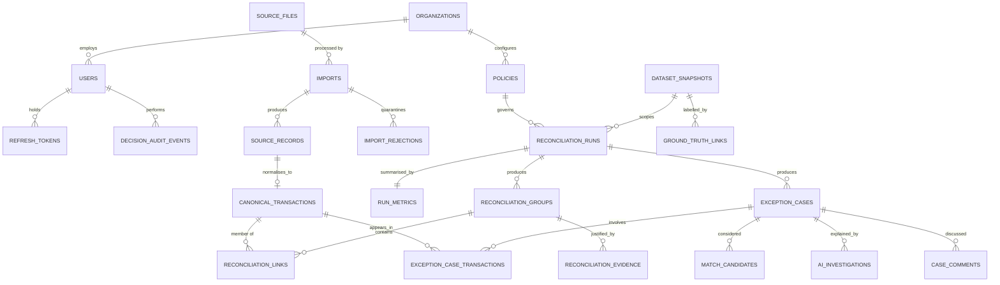

# LedgerGraph — Database Design

**Target** PostgreSQL 16 · **Full DDL** [`db/schema.sql`](../db/schema.sql) · **Applied via** Alembic

---

## 1. Design philosophy

The database is not a persistence detail here — it is the enforcement layer. The product's claim is that every decision is reproducible from source records plus deterministic arithmetic. That claim survives a bug in the service layer only if the constraints live in the database.

Six decisions shape everything below.

### 1.1 Money is `BIGINT` minor units. There is no money type that can hold a fraction.

Every amount column is `BIGINT` paise. `₹1,234.56` is `123456`. There is no `NUMERIC` money column and no `FLOAT` anywhere, because a column that *can* hold `1234.5599999` eventually will.

`BIGINT` gives ±9.2×10¹⁸ paise ≈ ±₹92 quadrillion. Not a constraint.

`NUMERIC(20,4)` appears in exactly one place — intermediate fee/tax computation inside a query, where a percentage genuinely produces a fraction — and the result is rounded to an integer before it is stored. The rounding is explicit and its direction is recorded.

### 1.2 Four mutability layers with different contracts

| Layer | Tables | Contract |
|---|---|---|
| **Immutable source** | `source_files`, `source_records`, `import_rejections` | Insert once. Never updated. If the source was wrong, import a correction as a new record. |
| **Derived canonical** | `canonical_transactions` | Written by normalisation. Re-normalisation updates in place and bumps `normalized_at`. |
| **Versioned results** | `reconciliation_runs` and everything scoped to a run | A rerun creates a new run. Old results are never overwritten, only superseded. |
| **Append-only log** | `decision_audit_events` | `UPDATE`/`DELETE` blocked by trigger. The application role has `INSERT`/`SELECT` only. |

This is what makes "show your work" structurally true rather than a convention.

### 1.3 One wide canonical table, not one table per source

Every entity — payment, refund, settlement batch, settlement line, bank transaction, invoice, ledger entry — normalises into `canonical_transactions`, discriminated by `entity_type`.

**Why:** matching is a self-join. R1 joins payments to settlement lines; R2 joins settlement batches to bank transactions; R5 joins ledger entries to either. With five tables that is a different join shape per rule and a combinatorial explosion of query variants. With one table every rule is the same shape, one index set serves all of them, and adding a sixth source type is a new `entity_type` value rather than a schema migration and five new queries.

**The cost:** some columns are null for some entity types — a bank transaction has no `fee_amount_minor`. That is handled by `CHECK` constraints keyed on `entity_type`, and it is a much smaller cost than the join explosion.

### 1.4 The universal amount identity

```sql
CHECK (net_amount_minor = gross_amount_minor - fee_amount_minor - tax_amount_minor)
```

This holds for **every** row, not just settlements, because entities without fees carry `fee = 0, tax = 0` and therefore `net = gross`. One constraint, universally true, checked by Postgres on every write.

It is the single most valuable line in the schema. A fee-mapping bug does not produce a wrong number in a report — it fails the `INSERT`.

### 1.5 Business date is stored, not computed on read

`event_at` is `TIMESTAMPTZ` (UTC). `business_date` is a stored `DATE` in the organisation's timezone.

**Why not a generated column:** `timestamptz AT TIME ZONE 'Asia/Kolkata'` is `STABLE`, not `IMMUTABLE` — the tz database can change — so Postgres refuses it in a `GENERATED ... STORED` column. Computing it on read instead would make every date-window query non-sargable and unable to use an index, which is exactly the query P2 in the architecture doc depends on.

So it is computed once during normalisation and stored, and the timezone used is recorded on the row. Settlement windows, aging, and daily trends all compare `business_date` — never raw UTC instants (PRD §6.2).

### 1.6 Exclusive group membership, enforced by a partial unique index

A transaction may belong to at most one group per run, except where the group explicitly supports split allocation:

```sql
CREATE UNIQUE INDEX uq_link_exclusive
  ON reconciliation_links (run_id, transaction_id)
  WHERE role <> 'split_component';
```

Without this, a bug in rule ordering silently counts the same payment in two groups and the reconciliation rate is quietly wrong in the direction that flatters you. `run_id` is denormalised onto the link precisely so this index can exist.

---

## 2. Entity relationships



**Cardinality worth stating explicitly**

| Relationship | Cardinality | Note |
|---|---|---|
| `source_records` → `canonical_transactions` | 1 : 0..1 | A quarantined row has no canonical form. |
| `reconciliation_groups` ↔ `canonical_transactions` | many : many via `reconciliation_links` | This is where 1:1, many:1, 1:many, and many:many all live. |
| `exception_cases` → `reconciliation_groups` | 0..1 | An unmatched payment has a case with **no** group — which is exactly the interesting case. |
| `exception_cases` ↔ `canonical_transactions` | many : many via `exception_case_transactions` | Members may include records not in any group. |
| `reconciliation_runs` → `run_metrics` | 1 : 1 | Split out so the run row stays narrow and cheap to poll. |

---

## 3. Enumerated types

Enums, not `VARCHAR` with a `CHECK`. A typo in an application constant becomes an error at insert rather than a row nobody's query matches.

| Type | Values |
|---|---|
| `user_role` | `analyst`, `reviewer`, `controller`, `admin` |
| `source_system` | `gateway_payments`, `razorpay_settlements`, `bank_statement`, `invoices`, `internal_ledger` |
| `entity_type` | `payment`, `refund`, `settlement_batch`, `settlement_line`, `bank_transaction`, `invoice`, `ledger_entry`, `adjustment`, `dispute` |
| `txn_direction` | `credit`, `debit` |
| `txn_status` | `created`, `authorized`, `captured`, `failed`, `refunded`, `partially_refunded`, `settled`, `reversed`, `disputed`, `cancelled`, `posted`, `pending` |
| `run_status` | `queued`, `running`, `completed`, `failed`, `cancelled` |
| `group_type` | `one_to_one`, `many_to_one`, `one_to_many`, `many_to_many` |
| `group_status` | `proposed`, `auto_resolved`, `pending_review`, `approved`, `rejected`, `superseded` |
| `link_role` | `payment`, `refund`, `settlement_batch`, `settlement_line`, `bank_credit`, `bank_debit`, `invoice`, `ledger_debit`, `ledger_credit`, `fee`, `tax`, `adjustment`, `split_component` |
| `exception_type` | `unmatched_payment`, `missing_bank_credit`, `amount_mismatch`, `date_mismatch`, `duplicate`, `refund_unlinked`, `status_conflict`, `fee_tax_discrepancy` |
| `exception_severity` | `critical`, `high`, `medium`, `low` |
| `exception_status` | `open`, `investigating`, `pending_approval`, `resolved`, `dismissed`, `unresolved` |
| `decision_action` | `auto_resolved`, `approved`, `rejected`, `overridden`, `assigned`, `commented`, `reopened`, `dismissed`, `role_changed`, `policy_changed` |
| `ai_validation_status` | `valid`, `schema_invalid`, `citation_violation`, `numeric_violation`, `unavailable` |
| `import_status` | `pending`, `validating`, `completed`, `failed`, `duplicate` |
| `truth_partition` | `tuning`, `holdout` |

**`exception_type` carries exactly the eight values from blueprint §10.** The AI's `classification` field is validated against this enum, so a hallucinated category cannot be stored.

---

## 4. Core tables

Full DDL with every constraint is in [`db/schema.sql`](../db/schema.sql). This section explains the ones where the design is non-obvious.

### 4.1 `canonical_transactions` — the centre of the schema

| Column | Type | Notes |
|---|---|---|
| `id` | `UUID` PK | Application-supplied UUIDv7 for index locality; DB default `gen_random_uuid()`. |
| `org_id` | `UUID` FK → `organizations` | Tenant scope on every query. |
| `source_record_id` | `UUID` FK → `source_records` | **Unique.** One canonical row per source row. The audit link back to raw truth. |
| `entity_type` | `entity_type` | The discriminator. |
| `source_system` | `source_system` | |
| `external_id` | `TEXT` | The ID as it exists in the source. |
| `external_id_norm` | `TEXT` | Trimmed, uppercased. **Joins use this; display uses `external_id`.** |
| `parent_external_id` | `TEXT` | Settlement line → its payment; refund → its payment. Drives R1. |
| `reference_id` | `TEXT` | UTR / narration-extracted reference. Drives R2 and R5. |
| `customer_ref` | `TEXT` | Masked in list views, pseudonymised before any prompt. |
| `currency` | `CHAR(3)` | ISO-4217. `CHECK` uppercase alpha. |
| `gross_amount_minor` | `BIGINT` | `CHECK >= 0`. Sign lives in `direction`, never in the amount. |
| `fee_amount_minor` | `BIGINT` | Default 0. |
| `tax_amount_minor` | `BIGINT` | Default 0. |
| `net_amount_minor` | `BIGINT` | `CHECK (net = gross − fee − tax)`. §1.4. |
| `direction` | `txn_direction` | The **only** carrier of sign. |
| `status` | `txn_status` | Controlled vocabulary; source status kept in `raw_payload`. |
| `event_at` | `TIMESTAMPTZ` | When it happened, UTC. |
| `available_at` | `TIMESTAMPTZ` | When money became available (settlement/value date). |
| `business_date` | `DATE` | Stored, in `business_timezone`. §1.5. |
| `business_timezone` | `TEXT` | Recorded so the derivation is reproducible. |
| `tz_assumed` | `BOOLEAN` | `true` when the source timestamp was naive (PRD §6.2). |
| `counterparty` | `TEXT` | |
| `description` | `TEXT` | Bank narration. **Treated as untrusted input** (architecture R1). |
| `metadata` | `JSONB` | Method, card network, account, etc. |
| `data_quality_flags` | `TEXT[]` | Non-empty caps confidence at 0.75 and blocks auto-resolution. |
| `normalized_at` | `TIMESTAMPTZ` | |

**Why `external_id_norm` is a separate stored column** rather than `UPPER(TRIM(external_id))` in the join: a function in the join predicate defeats the B-tree index, and the normalisation rule must be identical for every rule that joins on it. Storing it once makes the rule single-sourced and the join indexed. The original is retained for display and audit (blueprint §2 step 2: standardise IDs *without losing originals*).

### 4.2 `reconciliation_groups` — a match and its justification

The interesting columns are the ones that make the decision replayable:

| Column | Purpose |
|---|---|
| `confidence` | `NUMERIC(5,4)`, `CHECK BETWEEN 0 AND 1`. |
| `confidence_components` | `JSONB` — `rule_strength`, `data_quality`, `consistency`, `unambiguity`, and any cap applied. The score is re-derivable, not just recorded. |
| `matched_by_rule` | `R1`…`R7`. |
| `rule_tier` | `deterministic` \| `scored`. An auto-resolve gate input. |
| `gate_result` | `JSONB` — each of the six conditions with its evaluated value. **This is what an auditor reads to see why the system cleared or did not clear a case.** |
| `bridge` | `JSONB` — gross, refunds, fees, taxes, adjustments, net, computed difference, tolerance consumed. |
| `superseded_by` | Self-FK. Corrections supersede rather than overwrite. |
| `ruleset_version`, `policy_version` | Stamped for NFR-10. |

**A group cannot reach a resolved status without evidence.** Enforced by a deferred constraint trigger checking that at least one `reconciliation_evidence` row exists — the database-level expression of NFR-3.

### 4.3 `reconciliation_links` — membership with allocation

`(group_id, transaction_id)` is unique. `run_id` is denormalised so the exclusivity index in §1.6 can exist. `matched_amount_minor` is how much of that transaction this group claims — equal to the transaction's `net_amount_minor` for a whole match, a portion for a `split_component`.

A constraint trigger asserts that for any transaction participating in split components within a run, `SUM(matched_amount_minor) = net_amount_minor`. **Split allocation is the one place where money can be silently lost or duplicated,** so it is checked by the database rather than by the service.

### 4.4 `exception_cases` — the work queue

`amount_at_risk_minor` is the sort key and therefore the most important column in the product's day-to-day use. It is computed per exception type: for `missing_bank_credit` it is the settlement net; for `amount_mismatch` it is the absolute difference; for `duplicate` it is the duplicated amount.

`group_id` is **nullable** — an unmatched payment has a case and no group, and that is the most common interesting exception.

`resolution_reason_code` is `NOT NULL` whenever `resolution = 'overridden'`, enforced by a `CHECK`. PRD story D1 requires a reason code on override; this is where "requires" becomes true.

### 4.5 `ai_investigations` — the model's output, quarantined

Deliberately separate from `exception_cases`, and holding **no financial columns**. The AI writes classification, hypotheses, prose, and its own advisory confidence. There is no foreign key or column through which a model response can reach an amount or a group status.

`validation_status` records `valid` / `schema_invalid` / `citation_violation` / `numeric_violation` / `unavailable`, and failures are retained rather than discarded — the count of grounding violations is a metric worth showing, and a spike in it is a signal.

`packet_hash`, `prompt_version`, and `model_version` make a response reproducible: you can prove which evidence produced which explanation.

### 4.6 `decision_audit_events` — append-only, optionally chained

`entity_type` + `entity_id` is a polymorphic reference (no FK, because it points at several tables). `payload_json` holds the full before/after.

Two protections:
1. A trigger raises on `UPDATE` and `DELETE`. The application role is granted `INSERT`/`SELECT` only, so even a compromised connection cannot rewrite history.
2. `prev_hash` / `event_hash` form an optional hash chain per organisation, making silent deletion detectable rather than merely forbidden. Roughly twenty lines, and it turns "we do not allow tampering" into "tampering is detectable" — a materially stronger claim in an audit conversation.

### 4.7 `ground_truth_links` — how the metrics stay honest

Written by the synthetic generator, never by the engine, and **not readable by the matching code** — the engine has no import path to it.

`partition` is `tuning` or `holdout`, assigned by a stable hash of `truth_id` with a fixed seed. `injected_anomaly` names the defect (`delayed_settlement`, `duplicate_import`, `fee_variance`, …) so classification accuracy can be measured per anomaly type — which is what turns "85% accurate" into "we detect every duplicate and struggle with timezone shifts", a far more credible thing to present.

### 4.8 `idempotency_keys`

`(org_id, endpoint, key)` unique, storing `request_hash` and the original response. A replay with the same key and body returns the stored response; the same key with a *different* body returns `409`. Rows expire after 24h. This is what makes NFR-2 real for POSTs, complementing the unique constraints that make it real for rows.

---

## 5. Constraint summary

The constraints that carry real weight:

| Constraint | Table | Prevents |
|---|---|---|
| `net = gross − fee − tax` | `canonical_transactions` | Fee/tax mapping errors reaching the ledger. |
| `gross_amount_minor >= 0` | `canonical_transactions` | Sign ambiguity — direction is the only carrier of sign. |
| `UNIQUE (org_id, source_system, external_id)` | `source_records` | Re-import duplication. |
| `UNIQUE (row_hash)` | `source_records` | Content-identical rows under different IDs. |
| `UNIQUE (source_record_id)` | `canonical_transactions` | Double normalisation. |
| `UNIQUE (run_id, transaction_id) WHERE role <> 'split_component'` | `reconciliation_links` | The same money counted in two groups. |
| Split-sum constraint trigger | `reconciliation_links` | Money lost or created by an allocation. |
| Evidence-required trigger | `reconciliation_groups` | A resolution with no justification (NFR-3). |
| `CHECK (confidence BETWEEN 0 AND 1)` | groups, cases, investigations | Out-of-range scores from a bad computation. |
| `CHECK (resolution <> 'overridden' OR reason_code IS NOT NULL)` | `exception_cases` | An override with no stated reason (D1). |
| Append-only trigger | `decision_audit_events` | Audit tampering (R6). |
| `UNIQUE (org_id, endpoint, key)` | `idempotency_keys` | Duplicate side effects on retry. |
| `EXCLUDE` on active policy per org | `policies` | Two policies in force at once. |

---

## 6. Index plan

Indexes exist to serve named queries. Each one below has a query it was created for.

### Hot path

| Index | Serves |
|---|---|
| `(run_id, status, amount_at_risk_minor DESC)` on `exception_cases` | The queue's default sort. **The single hottest query in the product.** |
| `(run_id, status)` on `reconciliation_groups` | Run summary counts. |
| `(case_id, rank)` on `match_candidates` | Candidate table on the case page. |
| `(group_id)`, `(transaction_id)` on `reconciliation_links` | Graph traversal both directions. |

### Matching engine

| Index | Serves |
|---|---|
| `(org_id, external_id_norm)` on `canonical_transactions` | R1, R4 exact joins. |
| `(org_id, parent_external_id)` `WHERE parent_external_id IS NOT NULL` | R1 settlement-line lookup. Partial — most rows are null. |
| `(org_id, reference_id)` `WHERE reference_id IS NOT NULL` | R2, R5 reference joins. Partial. |
| `(org_id, currency, direction, status, business_date, net_amount_minor)` | **The candidate window index.** Turns P2's potential cross join into a bounded range scan. Column order matters: equality predicates first, then the range, then the amount. |
| `(org_id, entity_type, business_date)` | Snapshot scoping. |
| `(org_id, net_amount_minor, business_date)` `WHERE entity_type IN ('bank_transaction','settlement_batch')` | R6's amount+date probe. |

### Supporting

| Index | Serves |
|---|---|
| `(entity_type, entity_id, created_at DESC)` on `decision_audit_events` | Case audit history. |
| `(import_id, row_number)` on `import_rejections` | Paginated rejection report. |
| GIN on `metadata`, GIN on `data_quality_flags` | Investigation filters. Add only if a filter needs them. |
| `(user_id) WHERE consumed_at IS NULL` on `refresh_tokens` | Active token lookup. |
| `(snapshot_id, partition)` on `ground_truth_links` | Eval harness partition scan. |

### Deliberately absent

No index on `raw_payload` — it is read by primary key on a detail view, never filtered. No full-text index — the explorer searches identifiers by prefix, which a B-tree already serves. **Indexes cost write throughput, and ingestion is the write-heaviest path in the system.**

---

## 7. Views

Two, both for read simplification rather than logic.

**`v_exception_queue`** — pre-joins the case with its primary transaction, group summary, assignee name, and age in days. Removes the N+1 identified as P3.

**`v_reconciliation_summary`** — per-run counts and amounts by bucket (auto-resolved / pending review / unresolved), driving the overview cards and the CSV export header.

Both are plain views, not materialised. At demo scale the underlying indexes are enough, and a materialised view adds a refresh-staleness question nobody needs during a live demo.

---

## 8. Migration and seed strategy

**Migrations.** Alembic from commit one. `alembic revision --autogenerate` for the routine work, hand-written for the parts autogenerate cannot see: triggers, partial indexes, `EXCLUDE` constraints, and the grants that make `decision_audit_events` append-only. Autogenerate does not detect trigger drift, so treat those migration files as source of truth and keep them under review.

**Seeds** (`db/seeds/`), idempotent so `make seed` is safe to re-run:

1. One organisation, `Asia/Kolkata`, base currency `INR`.
2. Four demo users, one per role, verified, with known passwords for the demo.
3. Policy v1 with the PRD §5.3 defaults.
4. The fee schedule table (2% + 18% GST, per-method overrides).

**Synthetic data** is generated, not seeded — `make gen-data` writes five CSVs plus `ground_truth.json` into `data/synthetic/out/`. It stays out of git: it is large, regenerable from a seed, and committing it invites tuning against the held-out split by accident.

---

## 9. Sizing and growth

At 10,000 payments with realistic fan-out (settlement lines, bank credits, invoices, ledger postings):

| Table | Rows | Approx. size |
|---|---|---|
| `source_records` (with `raw_payload`) | ~35,000 | 40–60 MB |
| `canonical_transactions` | ~35,000 | 15 MB |
| `reconciliation_links` | ~50,000 | 6 MB |
| `reconciliation_evidence` | ~30,000 | 10 MB |
| `exception_cases` | ~500–1,500 | < 2 MB |
| `source_files.raw_bytes` | ~5 files | 5–15 MB |
| **Total per run** | | **~100 MB** |

Comfortable on any free-tier Postgres. Ten runs fit inside a 1 GB allowance.

**The first thing that will grow uncomfortably** is `source_records.raw_payload`, since every run's inputs are retained forever. The Phase 3 answer is a retention policy that moves `raw_payload` to cold storage after N days while keeping `row_hash` and `external_id` — deliberately not built now, and worth knowing the shape of.

---

## 10. What this schema deliberately does not do

| Not done | Why | When it would matter |
|---|---|---|
| Table partitioning | Adds migration and query complexity for a dataset that fits in memory. | Above ~10⁷ canonical rows: range-partition by `business_date`. |
| Row-level security | Application-layer `org_id` scoping is sufficient and simpler to reason about with one tenant. | Real multi-tenancy with shared connections. |
| Temporal / bitemporal tables | Versioned runs plus an append-only audit log already answer "what did we believe on date X". | Formal regulatory reporting. |
| Separate read replica | One instance handles both at this scale. | Sustained concurrent runs plus dashboard load. |
| Soft deletes | Nothing is deleted. Records are superseded. | Never, hopefully. |
| A rules table (DSL) | Rules are Python and version-controlled. Thresholds are already config. | A finance user needing to author rules without a deploy. |

---

## 11. The schema

Complete PostgreSQL DDL: **[`db/schema.sql`](../db/schema.sql)**

It is written as a single runnable script for reading and review. In the repository it is applied through Alembic — the file is the authoritative reference for what the migrations must produce, and a convenient way to stand up a scratch database for experiments.
