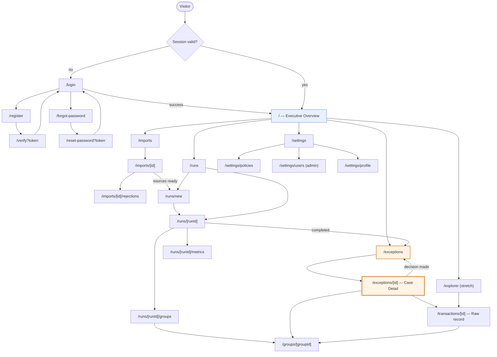
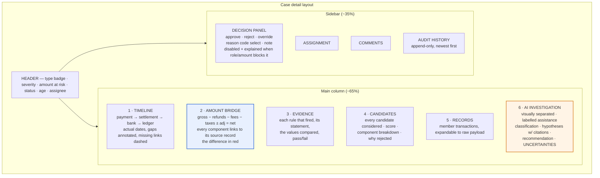
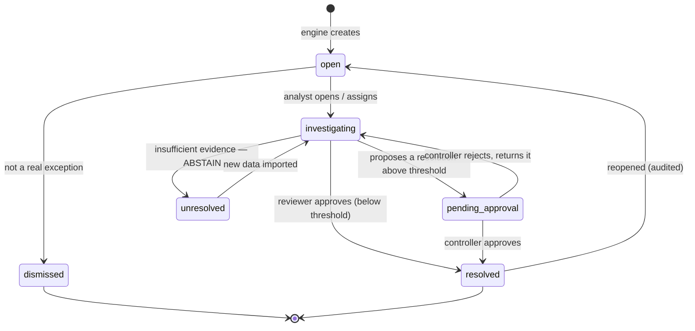
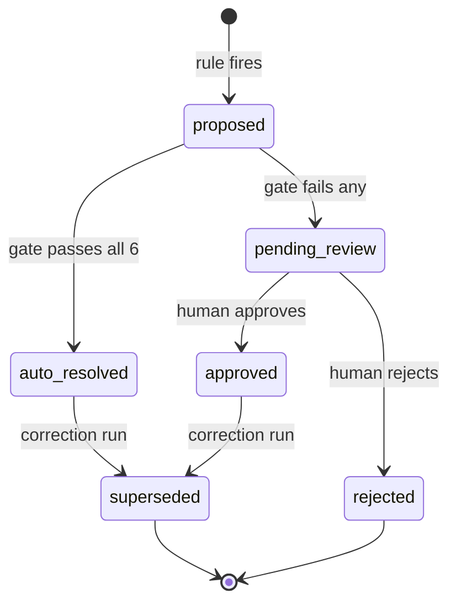
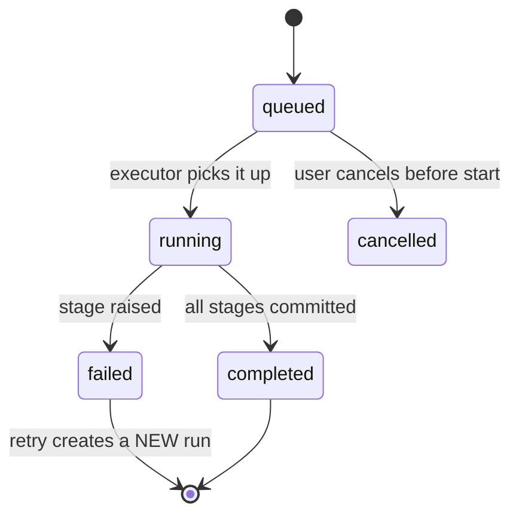
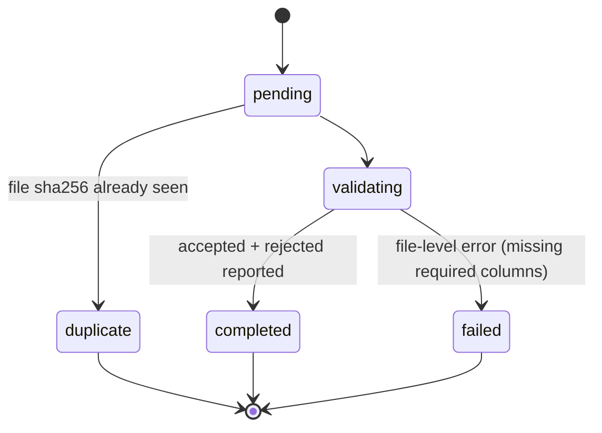
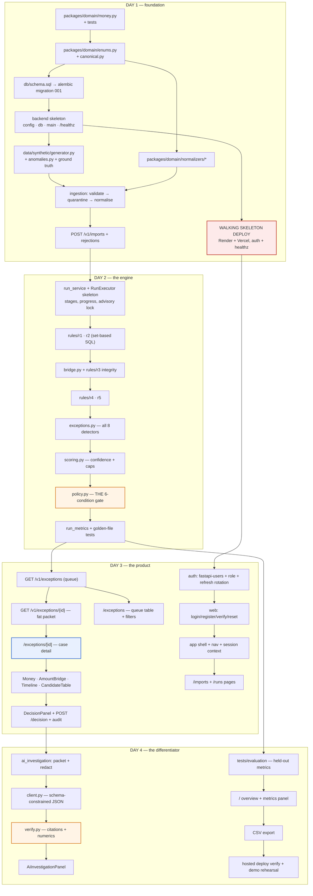

# TallyProof — UI/UX Flowcharts & Build Map

**The working document for day 3.** Every screen, every function on it, every state it can be in, and the order to build the files in.

---

## 1. Complete screen map

**The two orange screens are the product.** If day 3 runs short, `/exceptions` and `/exceptions/[id]` are the two that must be finished. Everything else can be a table with no styling.

---

## 2. The critical path — one user journey, end to end

```mermaid
flowchart LR
    A["Log in"] --> B["Upload 5 CSVs"]
    B --> C["See accepted / rejected"]
    C --> D["Start run"]
    D --> E["Watch progress"]
    E --> F["See metrics:<br/>auto-resolved / review / unresolved"]
    F --> G["Open queue,<br/>worst money first"]
    G --> H["Open a case"]
    H --> I["Read timeline + bridge<br/>+ candidates"]
    I --> J["Request AI investigation"]
    J --> K["Approve or override<br/>with reason"]
    K --> L["See audit entry"]
    L --> M["Export CSV"]

    style H fill:#fff4e6,stroke:#d9822b
    style I fill:#fff4e6,stroke:#d9822b
```

**This is also the demo script and the Playwright test.** Build these thirteen steps before building anything else.

---

## 3. Screen-by-screen function inventory

Every function you have to write, per screen. Use it as a checklist.

### 3.1 `/login`, `/register`, `/verify`, `/forgot-password`, `/reset-password`

| Function | Behaviour | State to handle |
|---|---|---|
| `submitLogin` | POST credentials → store access token in memory, refresh cookie set by server | idle · submitting · `invalid_credentials` · `EMAIL_NOT_VERIFIED` · `account_inactive` |
| `submitRegister` | POST → success screen telling the user to check email/logs | idle · submitting · `email_taken` · `weak_password` |
| `submitVerify` | Read `?token`, POST, redirect to login with a success banner | verifying · verified · `token_expired` · `token_used` |
| `submitForgot` | POST email. **Always** shows the same success message | idle · submitting · sent |
| `submitReset` | POST token + new password | idle · submitting · `token_invalid` · success |
| `passwordStrength` | Client-side meter; the server is still the authority | — |

**Two details that matter.** Forgot-password shows an identical message whether or not the email exists — otherwise the form is an account-enumeration oracle. And the register success screen must say *where* to find the token in the demo environment (the API logs), because there is no SMTP configured.

### 3.2 `/` — Executive overview

| Function | Behaviour |
|---|---|
| `loadSummary(runId?)` | Defaults to the latest completed run; a run selector switches it |
| `renderKpiCards` | Gross processed · reconciled value · unresolved value · reconciliation rate |
| `renderBucketSplit` | Stacked bar: auto-resolved / pending review / unresolved. **By value and by count — toggleable, because they tell different stories** |
| `renderExceptionsBySeverity` | Grouped bar by type × severity |
| `renderAgingChart` | Buckets: 0–1d, 2–3d, 4–7d, 7d+ |
| `renderSettlementTrend` | Daily settlement→bank completion, last 14 days |
| `renderRunHealth` | Files processed · invalid rows · duration · failures |
| `renderEvalMetrics` | Precision · recall · auto-resolution precision · **false-clear rate**, with the ruleset version stamped |
| `onCardClick` | Every card deep-links into the filtered queue. A number you cannot click is a dead end |

**Empty state:** no runs yet → a single "Import data to begin" call to action. Do not render zeroed cards; an empty dashboard of zeros looks broken.

### 3.3 `/imports` and `/imports/[id]`

| Function | Behaviour |
|---|---|
| `selectSourceType` | Required before upload — the parser is chosen by declared type, never sniffed |
| `uploadFile` | Multipart with a generated `Idempotency-Key`; upload progress bar |
| `pollImportStatus` | 1s poll while `validating` |
| `renderCounts` | total / accepted / rejected, as a bar not just numbers |
| `renderRejectionTable` | Paginated: row № · column · raw value · error code · message |
| `filterRejectionsByCode` | Group by `error_code` — one bad column usually explains hundreds of rows |
| `downloadRejectionsCsv` | So the fix happens in the source system |
| `downloadRawFile` | Audit action; writes an audit event |
| `onDuplicateFile` | Banner: "identical file already imported on <date>" + link to the original import |

**Empty state:** the five source types as cards, each showing "not yet imported", so it is obvious what is missing.

### 3.4 `/runs/new` and `/runs/[runId]`

| Function | Behaviour |
|---|---|
| `selectDateRange` | Defaults to the range covered by imported data |
| `selectSources` | Checkboxes, pre-checked for whatever is imported |
| `previewSnapshot` | "This run will process 34,812 records across 5 sources." **Show this before the button** |
| `showActivePolicy` | Current thresholds and version, read-only, with a link to settings |
| `startRun` | POST → 202 → navigate to the run page |
| `onConcurrentRunBlocked` | 409 → "A run is already in progress on this snapshot" + link to it |
| `pollRunStatus` | 2s poll; stops on terminal status; backs off after 5 min |
| `renderStageProgress` | The seven stages as a checklist: ingest → normalise → R1 → R2 → R3 → R4/R5 → exceptions. **Show which rule is running** — it is genuinely interesting and it makes the wait feel like work |
| `renderRunMetrics` | On completion: bucket split, counts, duration, throughput |
| `onRunFailed` | Failed stage + error + a "retry" that creates a new run |
| `goToQueue` | Primary CTA on completion: "Review 27 exceptions" |

### 3.5 `/exceptions` — the queue *(build this first)*

| Function | Behaviour |
|---|---|
| `loadQueue(filters, cursor)` | Server-rendered, cursor-paginated |
| `applyFilters` | status · severity · type · date range · source · assignee · amount band · confidence band |
| `syncFiltersToUrl` | Filters live in the URL — shareable, back-button-correct, and reload-safe |
| `sortBy` | **Default: `amount_at_risk` descending.** Also age, confidence, severity |
| `renderRow` | Severity dot · type badge · amount at risk (mono, right-aligned) · primary ID · age · confidence badge · assignee · AI indicator |
| `bulkSelect` | Checkbox column |
| `bulkAssign` | Assign selected to a user |
| `quickView` | Row click opens a side drawer with the summary; **the drawer is a preview, decisions happen on the case page** |
| `openCase` | Navigate to `/exceptions/[id]` |
| `savedViews` | "My open cases", "Critical unresolved", "Above ₹1L" — stored in `localStorage` |
| `exportFiltered` | CSV of the current filter |

**Density matters.** This is a table a person stares at for hours: mono-spaced amounts, right-aligned, ~40px rows, sticky header, no card wrappers. Resist decorating it.

### 3.6 `/exceptions/[id]` — case detail *(the most important screen in the product)*

| Function | Behaviour |
|---|---|
| `loadCase` | **One request** returns the whole packet (architecture §6.3) |
| `renderTimeline` | Horizontal stages with real dates; a missing stage is a dashed outline, not an omission. Annotate gaps: "settled T+4 — outside the 3-day window" |
| `renderBridge` | The arithmetic, laid out as arithmetic. Each component's amount links to its source record. Tolerance consumed is shown, never hidden |
| `renderEvidence` | Per rule: statement, values compared, pass/fail icon |
| `renderCandidates` | Score bar per candidate with its component breakdown on hover, and the rejection reason in plain words. **When two candidates are within the margin, say so loudly — that is the abstention, and it is the thing worth showing a judge** |
| `expandRawRecord` | Inline raw payload viewer, PII masked with an unmask action that writes an audit event |
| `requestInvestigation` | POST → loading → render. Idempotent per (case, prompt_version) — clicking twice does not pay twice |
| `renderAiPanel` | Distinct background, an "AI assistance" label, citation chips that scroll to the cited evidence, and `uncertainties` rendered **as prominently as the hypotheses** |
| `onAiUnavailable` | "The AI could not produce a grounded answer" + the reason (`schema_invalid` / `citation_violation` / `numeric_violation`). **Never hide this — a visible refusal is the strongest possible demonstration of the grounding check** |
| `submitDecision` | approve / reject / override. Reason code required on override. No optimistic update |
| `onDecisionForbidden` | 403 → explain *which* rule blocked it ("cases above ₹2,50,000 require a controller"), not a generic error |
| `assignCase` / `addComment` | |
| `renderAuditHistory` | Actor · role · action · reason · timestamp · versions |
| `nextCase` | "Save and next" — keeps the analyst in the queue rather than bouncing back |
| `keyboardShortcuts` | `j`/`k` navigate, `a` approve, `r` reject, `i` investigate, `?` help |

### 3.7 `/groups/[groupId]`, `/transactions/[id]`, `/explorer`

| Screen | Functions |
|---|---|
| Group detail | `renderGroupSummary` · `renderLinks` (role, matched amount) · `renderEvidence` · `renderBridge` · `renderGateResult` (**all six conditions with their evaluated values — this is the auditor's screen**) · `viewSupersededChain` |
| Transaction detail | `renderCanonical` · `renderRawPayload` · `renderNormalisationDiff` (source value → canonical value, side by side) · `renderMemberships` · `renderRelatedCases` |
| Explorer *(stretch)* | `search` by any ID/reference · `renderGraph` (nodes = transactions, edges = links) · `focusNode` · `filterByType` · `jumpToCase` |

The **normalisation diff** on the transaction page is small and disproportionately convincing: it shows `"1,234.56"` → `123456 paise` and `"2026-03-01 23:58"` → `2026-03-01T18:28:00Z (business date 2026-03-01, tz assumed IST)`. It makes the invisible normalisation layer visible.

### 3.8 `/settings/*`

| Screen | Functions | Role |
|---|---|---|
| Policies | `renderCurrent` · `editThresholds` · `previewImpact` ("this would have auto-resolved 12 more cases in the last run") · `savePolicy` (new version + audit event) · `viewHistory` | controller+ |
| Users | `listUsers` · `changeRole` (audited) · `deactivate` · `invite` | admin |
| Profile | `updateName` · `changePassword` · `viewSessions` · `revokeSession` | all |

`previewImpact` is worth the hour it costs. It turns an abstract threshold into a visible consequence and is a strong thing to show live.

---

## 4. State machines

### 4.1 Exception case

**`unresolved` is a first-class terminal-ish state, not a failure.** Blueprint §17: *abstention is safer than a fabricated match.* The UI must make it easy to reach and must never style it as an error.

### 4.2 Reconciliation group

Nothing is ever deleted or edited in place. A correction supersedes.

### 4.3 Run

### 4.4 Import

Note the distinction: a **row**-level problem produces a rejection and the import still completes; a **file**-level problem (missing required column, unparseable) fails the whole import. Rejecting rows one at a time when the header is wrong produces thousands of useless rejections.

---

## 5. Component tree

```mermaid
flowchart TD
    APP["app/(app)/layout.tsx<br/>nav · run banner · user menu"]

    APP --> UI["components/ui/ — shadcn<br/>Button Dialog Select Table Tabs Badge Tooltip Drawer"]
    APP --> MONEY["components/money/"]
    APP --> CASE["components/case/"]
    APP --> CHART["components/charts/"]
    APP --> SHARED["components/shared/"]

    MONEY --> M1["Money.tsx — THE only paise renderer"]
    MONEY --> M2["AmountBridge.tsx"]
    MONEY --> M3["ConfidenceBadge.tsx"]
    MONEY --> M4["AmountAtRisk.tsx"]

    CASE --> C1["CaseHeader.tsx"]
    CASE --> C2["Timeline.tsx"]
    CASE --> C3["EvidencePanel.tsx"]
    CASE --> C4["CandidateTable.tsx"]
    CASE --> C5["RecordCard.tsx + RawPayloadViewer.tsx"]
    CASE --> C6["AiInvestigationPanel.tsx"]
    CASE --> C7["DecisionPanel.tsx"]
    CASE --> C8["AuditTimeline.tsx"]
    CASE --> C9["CommentThread.tsx"]

    CHART --> H1["BucketSplitBar · SeverityBar · AgingChart · TrendLine · MetricsGrid"]

    SHARED --> S1["DataTable.tsx — sort, cursor paging, sticky header"]
    SHARED --> S2["FilterBar.tsx — URL-synced"]
    SHARED --> S3["StatusBadge · SeverityDot · EmptyState · ErrorBoundary"]
    SHARED --> S4["ProgressStages.tsx"]

    style M1 fill:#e8f0fe,stroke:#3b6fd4,stroke-width:2px
    style C6 fill:#fff4e6,stroke:#d9822b
```

**`Money.tsx` is the only component that turns paise into a display string.** Everything else passes the raw string through. That is what makes the frontend structurally unable to do arithmetic on money.

---

## 6. Build order

The dependency graph, and the order to actually type things in.

### The five things to get right in the order

1. **`money.py` is file number one.** Everything downstream depends on the paise representation being settled. Writing it third means retrofitting it everywhere.
2. **The generator ships on day 1, with its anomalies.** Ground truth with no injected defects proves nothing, and building the injector on day 4 means the metrics are computed on data you tuned against.
3. **The walking-skeleton deploy is day 1, not day 4.** CORS, cross-site cookies, migrations, env vars, and build config each have a way of failing that only appears in the hosted environment. Discover them while they cost an hour.
4. **The queue and case page come before the overview dashboard.** The dashboard is the most cuttable screen and the most tempting to build first because it is fun. Build it last.
5. **The gate (`policy.py`) and the verifier (`verify.py`) are the two orange boxes.** They are each roughly 80 lines and they are the entire differentiated claim of the submission. Protect their time.

---

## 7. UX principles for this specific product

Six rules, each with a concrete implication. They are what make it read as a finance tool rather than a dashboard.

### 7.1 Every number is traceable in one click

No total appears without a path to its components. The reconciliation rate links to the run; the run links to its groups; a group links to its evidence; evidence links to raw records. **A number you cannot drill into is a number an auditor cannot trust** — and this is the product principle from blueprint §22 expressed as an interaction rule.

### 7.2 Uncertainty is displayed, never smoothed

Confidence is a badge with a band and a tooltip listing the components. `unresolved` is styled neutrally, not as an error. The AI panel's `uncertainties` list is as visually prominent as its hypotheses. **A system that hides its doubt is asking to be trusted for the wrong reason.**

### 7.3 AI output is visually quarantined

Distinct background, an explicit "AI assistance" label, and citation chips that jump to the underlying evidence. A user must never be unsure whether they are reading a computed fact or a generated sentence. When grounding verification fails, say so — an AI panel that visibly refuses is more persuasive than one that always has an answer.

### 7.4 Destructive and material actions state their consequence

Override asks for a reason code before it enables the button. Approval above the threshold shows the amount and the role requirement in the confirmation. A blocked action explains *which* rule blocked it and who can perform it.

### 7.5 Money renders identically everywhere

`₹1,23,456.78` — Indian grouping, two decimals always, mono-spaced, right-aligned, currency symbol present. Negative in red with an explicit minus. Zero as `₹0.00`, never a dash. One component, no exceptions.

### 7.6 Density over decoration

40px rows, sticky headers, no cards around table rows, no gratuitous whitespace. Colour used only for meaning: severity, direction, pass/fail. This is a screen someone works in for hours, not a screen someone admires for ten seconds.

---

## 8. Design tokens

| Token | Value | Used for |
|---|---|---|
| Severity critical / high / medium / low | red-600 / orange-500 / amber-400 / slate-400 | Dots, badges |
| Confidence high ≥0.95 / medium 0.75–0.94 / low <0.75 | emerald-600 / amber-500 / slate-500 | Badges |
| Direction credit / debit | emerald-700 / rose-700 | Amounts |
| Bridge match / mismatch | slate-700 / rose-600 | Bridge difference row |
| AI panel surface | amber-50 bg, amber-200 border | Quarantining generated content |
| Numeric font | `ui-monospace`, tabular-nums | Every amount, every ID |
| Row height | 40px | Tables |
| Status: resolved / review / unresolved | emerald / amber / slate | Buckets everywhere |

`tabular-nums` is not cosmetic: without it, digits have different widths and a column of amounts will not align, which makes scanning for an outlier much harder.

---

## 9. Day-3 checklist

Tick these in order. If the clock runs out, everything below the line is genuinely optional.

**Must ship**
- [ ] Login, register, verify, reset — all five screens working end to end
- [ ] App shell with nav and session
- [ ] Upload with accepted/rejected counts and a rejection table
- [ ] Start a run and watch stage progress
- [ ] Run completion metrics with the bucket split
- [ ] Exceptions queue: filters, URL sync, amount-at-risk sort
- [ ] Case detail: header, timeline, bridge, evidence, candidates, records
- [ ] Decision panel with reason codes and the 403 explanation
- [ ] Audit history on the case

— *line* —

**Should ship**
- [ ] AI investigation panel with citations and uncertainties
- [ ] Executive overview with KPI cards and charts
- [ ] Held-out metrics panel
- [ ] CSV export

**Nice to have**
- [ ] Reconciliation explorer with the relationship graph
- [ ] Saved views, keyboard shortcuts, bulk assign
- [ ] Policy `previewImpact`
- [ ] Normalisation diff on the transaction page
